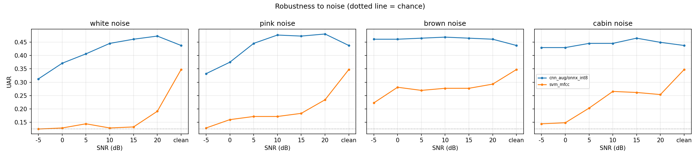
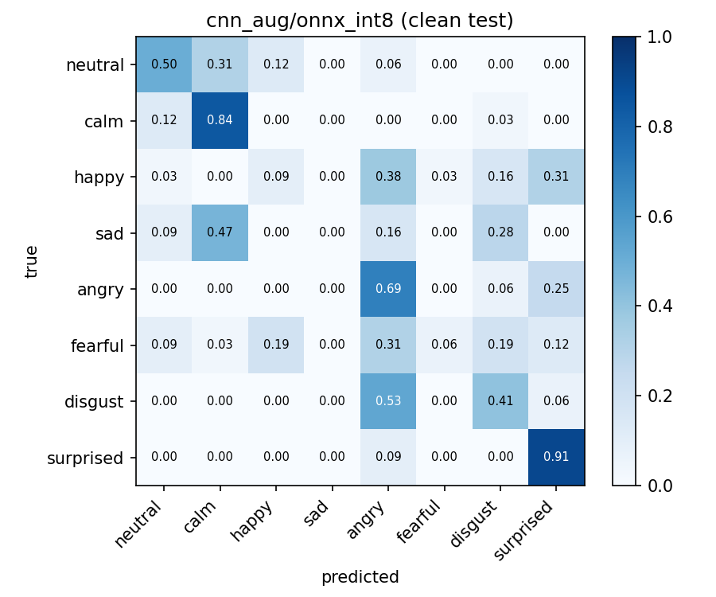
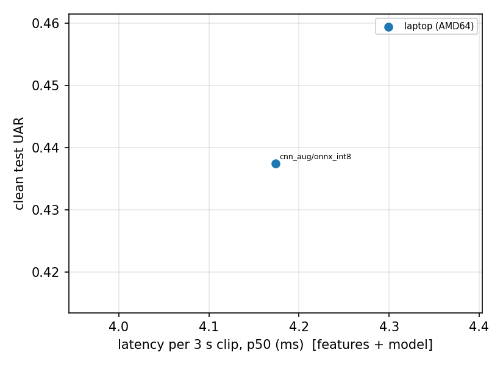

**Speech Emotion Recognition (SER) under noise, from training to edge deployment.**

Most SER tutorials stop at "accuracy on a clean test set". This project asks the
questions that matter when a model has to run for real, for example on a device in a car:

1. How much does accuracy drop when the audio is noisy?
2. Does training with noise augmentation help?
3. After converting to **ONNX** and quantizing to **INT8**, how much accuracy do we lose,
   and what do we gain in model size and speed?
4. Does it run in real time on a small device?

Every number below comes from a file in `results/` or `runs/`, and everything can be
reproduced with the commands in this README.

```
 wav -> trim/pad 3 s -> [+ noise at chosen SNR] -> log-mel (NumPy) -> model -> emotion
                                                      |
            train / evaluate (PyTorch)    export -> ONNX FP32 -> INT8 -> benchmark (ONNX Runtime)
```

## Status

| Experiment | Status |
|---|---|
| MFCC + SVM baseline, clean and noisy test | done |
| CNN without noise augmentation, **clean** test | done |
| CNN with noise augmentation, clean test | done |
| CNN with noise augmentation, INT8 ONNX, clean + noisy test | done |
| ONNX FP32 / INT8 export, parity check | done |
| Latency / memory benchmark on an x86-64 laptop | done |
| CNN **without** augmentation under noise | not run yet |
| ONNX FP32 under noise (accuracy cost of INT8 across all conditions) | not run yet |
| CRNN (CNN + GRU) | not run yet |
| Real noise recordings (`--noise_dir`) | not run yet |
| Benchmark on an ARM64 device | **not done**: no ARM64 hardware was available (see [Benchmarking on ARM64](#benchmarking-on-arm64-not-done-here-how-to-do-it)) |
| Several random seeds | not run yet |

Because of the gaps above, some questions can only be partly answered. The Findings section
says exactly which claims the data supports and which it does not.

## Results

Setup: RAVDESS speech, 8 emotions, **speaker-independent** split (actors 1-16 train,
17-20 validation, 21-24 test = 240 test clips). One training run per model (seed 42),
30 epochs. Chance level is UAR = 0.125. UAR = unweighted average recall (mean of per-class recall).

**How much to trust the numbers.** With 240 test clips from only 4 speakers, a UAR value has a
95% uncertainty of roughly +/- 0.06 (a rough estimate that treats clips as independent, so the
real uncertainty is probably larger). Differences smaller than that, from a single run, should
not be read as real effects.

### 1. Clean test set

| Model | Noise aug. | UAR | Macro-F1 | Accuracy | Best val UAR |
|---|---|---|---|---|---|
| MFCC + SVM | no | 0.348 | 0.351 | 0.346 | - |
| CNN (98k parameters, PyTorch) | no | 0.422 | 0.383 | 0.421 | 0.508 |
| CNN (98k parameters, PyTorch) | yes | 0.441 | 0.362 | 0.438 | 0.426 |
| CNN, ONNX INT8 | yes | 0.438 | 0.360 | 0.433 | - |

Sources: `runs/cnn/metrics.json`, `runs/cnn_aug/metrics.json`,
`results/robustness_svm_mfcc.csv`, `results/robustness_cnn_aug_onnx_int8.csv`.

### 2. Robustness to noise

UAR at selected SNRs (dB). Each cell is **CNN with noise augmentation (INT8) / MFCC + SVM**.
Clean test: CNN 0.438, SVM 0.348.

| Noise | 20 dB | 10 dB | 0 dB | -5 dB |
|---|---|---|---|---|
| white | 0.473 / 0.191 | 0.445 / 0.129 | 0.371 / 0.129 | 0.312 / 0.125 |
| pink | 0.480 / 0.234 | 0.477 / 0.172 | 0.375 / 0.160 | 0.332 / 0.129 |
| brown | 0.461 / 0.293 | 0.469 / 0.277 | 0.461 / 0.281 | 0.461 / 0.223 |
| cabin (synthetic) | 0.449 / 0.254 | 0.445 / 0.266 | 0.430 / 0.148 | 0.430 / 0.145 |



### 3. Which emotions are confused



Per-class recall (diagonal): surprised 0.91, calm 0.84, angry 0.69, neutral 0.50, disgust 0.41,
happy 0.09, fearful 0.06, **sad 0.00**. The model never predicts "sad". Typical confusions are
sad -> calm (0.47), disgust -> angry (0.53), happy -> angry / surprised (0.38 / 0.31), and
fearful -> angry (0.31).

### 4. Size, speed and memory (x86-64 laptop, 1 thread, 3 s clip, 200 runs)

| Model | Size (MB) | Features p50 (ms) | Model p50 (ms) | Total p50 / p95 (ms) | RTF | Peak RAM (MB) |
|---|---|---|---|---|---|---|
| CNN FP32 | 0.396 | 2.22 | 1.18 | 3.40 / 3.77 | 0.0011 | 66.5 |
| CNN INT8 | 0.111 | 2.52 | 1.65 | 4.17 / 4.62 | 0.0014 | 68.2 |

Machine: Intel CPU (`Intel64 Family 6 Model 141`), Windows (which reports x86-64 as "AMD64"),
Python 3.11.5, ONNX Runtime 1.30.0. Source: `results/benchmark_laptop.csv`.
RTF = real-time factor = latency / audio duration (below 1 is faster than real time).



(The trade-off plot has a single point because only the INT8 model was evaluated on the test set.
Evaluating the FP32 model adds the second point.)

## Findings

**Supported by the data**

- **Noise destroys the classical baseline.** MFCC + SVM, trained on clean audio only, falls from
  0.348 to about chance (0.13-0.14) at 15 dB or lower white noise, and stays low for pink noise.
  Differences this large are well outside the uncertainty.
- **The noise-trained CNN degrades gracefully.** It keeps UAR 0.31-0.37 at 0 to -5 dB white noise,
  where the SVM is at chance. How much of this is due to the architecture and how much to
  noise augmentation cannot be separated yet (see Limitations).
- **Damage depends on the noise spectrum.** The ordering is white (-0.125 from clean to -5 dB),
  pink (-0.105), then cabin and brown (about 0 change). A plausible explanation is that white noise
  spreads energy over all frequencies and masks the mid/high mel bands, while brown and the
  synthetic cabin noise put most energy at very low frequencies, below where most emotion cues
  are. This explanation was not tested directly.
- **INT8 shrinks the model 3.6x and costs about one clip of accuracy** on the clean test set
  (105 vs 104 of 240 correct, FP32 PyTorch vs INT8 ONNX). Parity check torch vs ONNX FP32:
  max output difference 2.9e-06 (`runs/cnn_aug/export_report.json`).
- **INT8 was slower here, not faster.** Model time +40% (1.18 -> 1.65 ms), total time +23%, and
  peak RAM about the same (+1.7 MB). Dynamic quantization adds quantize/dequantize work at run
  time, and on this laptop CPU that cost outweighs the integer arithmetic gain. This is a
  measurement on one machine; an ARM64 device may behave differently, which is why the
  benchmark must be repeated on the target hardware.
- **Feature extraction costs more than the model.** NumPy log-mel takes 60-65% of total time.
  If latency ever mattered, that is the first thing to optimize, not the network.
- **Both pipelines are far faster than real time on this laptop** (roughly 700-900x), so latency
  is not the bottleneck here. Peak RAM (about 66-68 MB) is dominated by the Python/ONNX Runtime
  process, not by the 0.4 MB model.
- **Errors fall between emotions with similar energy** (sad/calm, happy/fearful/surprised/angry).
  This is typical for SER and suggests the model captures how energetic the speech is more than
  its finer emotional character.

**Not supported yet (do not claim these)**

- *"Noise augmentation improves accuracy."* Clean UAR is 0.422 without and 0.441 with augmentation,
  a difference of about 5 clips, inside the uncertainty, and macro-F1 goes the other way
  (0.383 vs 0.362). The decisive comparison, the CNN **without** augmentation under noise, has
  not been run.
- *"CNN is more robust than SVM because of the architecture."* The SVM never saw noise during
  training, the CNN did. This compares "trained with noise" against "trained without".
- *"Noise sometimes improves accuracy."* Some noisy conditions score above clean (for example
  pink 20 dB: 0.480 vs 0.438). These gaps are within the uncertainty. They may come from the
  augmentation acting as regularization, or from chance.
- *"The model generalizes to unseen noise."* The evaluation noise types (white, pink, brown, cabin)
  are the same types used in augmentation. No real recordings were tested.
- *"It would work in a car."* RAVDESS is acted studio speech, and "cabin" is synthetic noise.

## Limitations of this study

- Single training run, single seed, small test set (240 clips, 4 speakers). The validation UAR
  jumps by 0.1 or more between epochs (`runs/*/history.csv`), and the best-epoch choice on a
  small validation set is itself noisy. For example CNN scores 0.508 on validation but 0.422
  on test.
- Training had not converged: the loss was still decreasing at epoch 30 and validation UAR was
  still rising for the CNN without augmentation. Longer training or a larger model would
  probably score higher. The absolute scores (UAR about 0.44) are modest for RAVDESS.
- The model never predicts "sad" (recall 0.00). This should be investigated (more epochs,
  other seeds, class weighting, a larger model) before trusting per-class conclusions.
- Acted English speech by 24 North American actors, recorded in a studio. Results will not
  transfer directly to spontaneous speech, other languages or real in-car audio.
- "cabin" noise is a synthetic approximation, not a recording.
- SNR is computed over the whole 3 s clip, including any zero padding.
- Latency was measured on one x86-64 laptop with one thread. **There is no ARM64 measurement** because no ARM64 hardware was available, so statements about edge devices are limited to what this laptop shows. INT8 in particular may behave differently on ARM64.

## Next steps

Run the missing experiments first, since they answer the open questions above:

```bash
# 1) the key comparison: CNN without noise augmentation, under noise
python -m ser.evaluate --data_root data/ravdess --run runs/cnn --variant torch

# 2) FP32 under noise (accuracy cost of INT8 over all conditions) and the 2nd point of the trade-off plot
python -m ser.evaluate --data_root data/ravdess --run runs/cnn_aug --variant torch
python -m ser.evaluate --data_root data/ravdess --run runs/cnn_aug --variant onnx_fp32

# 3) test on noise the model has not seen in training
python -m ser.evaluate --data_root data/ravdess --run runs/cnn_aug --variant torch --noise_dir path/to/noise_wavs
python -m ser.baseline --data_root data/ravdess --noise_dir path/to/noise_wavs

# 4) other seeds and longer training
python -m ser.train --data_root data/ravdess --model cnn --aug_noise --epochs 60 --seed 1 --out runs/cnn_aug_s1

python -m ser.plots
```

ARM64 measurements are described in [Benchmarking on ARM64](#benchmarking-on-arm64-not-done-here-how-to-do-it).
Further ideas: the CRNN (`--model crnn`), pre-trained encoders (wav2vec 2.0, WavLM, emotion2vec, Whisper
encoder) as feature extractors on the same noise sweep, arousal / valence regression with CCC (needs a
dataset such as MSP-Podcast, check its access terms), static INT8 with calibration data, and a
cross-corpus test.

## Quickstart

```bash
python -m venv .venv && source .venv/bin/activate      # Windows: .venv\Scripts\activate
pip install -r requirements.txt
pip install -e .

make test      # unit tests + end-to-end smoke test on synthetic data (~1-2 min on CPU)
make demo      # tiny synthetic dataset, checks the whole pipeline, no download needed
```

The synthetic demo only proves that the code runs. Its scores mean nothing about real speech.

### Run on real data (RAVDESS)

1. Download `Audio_Speech_Actors_01-24.zip` from the RAVDESS page on Zenodo
   (https://zenodo.org/records/1188976) and unzip it into `data/ravdess/`.
   The dataset is licensed **CC BY-NC-SA 4.0** (non-commercial, share-alike, attribution).
   Do not commit the audio to the repository.
2. Run the experiments:

```bash
python -m ser.baseline  --data_root data/ravdess                               # MFCC + SVM reference
python -m ser.train     --data_root data/ravdess --model cnn --out runs/cnn    # clean training
python -m ser.train     --data_root data/ravdess --model cnn --out runs/cnn_aug --aug_noise
python -m ser.export_onnx --run runs/cnn_aug                                   # ONNX + INT8
python -m ser.evaluate  --data_root data/ravdess --run runs/cnn_aug --variant onnx_int8
python -m ser.benchmark --models runs/cnn_aug/model.onnx runs/cnn_aug/model.int8.onnx --tag laptop
python -m ser.plots
```

Or `make experiments DATA=data/ravdess EPOCHS=30 TAG=laptop` for the full set.

For real noise, download a set such as ESC-50, DEMAND or MUSAN, check its license, and add
`--noise_dir path/to/noise_wavs` to `ser.evaluate` and `ser.baseline`. Results then include a `real` noise type.

## Benchmarking on ARM64 (not done here, how to do it)

The benchmark in this repo was **only run on an x86-64 laptop**, because the author has no ARM64 device.
The tooling is ready, so anyone with access to ARM64 hardware can repeat it. Inference needs only
`numpy`, `pandas` and `onnxruntime` (no PyTorch). The command is the same on every machine, only `--tag` changes:

```bash
python -m ser.benchmark --models models/cnn_aug/model.onnx models/cnn_aug/model.int8.onnx --tag my-arm-device --threads 1
```

The CSV records the architecture (`arch`), CPU name, ONNX Runtime version and thread count, so results from
different machines can be compared with `python -m ser.plots`.

Ways to get ARM64 numbers, from closest to a real edge device to least:

1. **Raspberry Pi 4/5 or a similar single-board computer.** Closest to a real edge scenario. Copy the repo and the
   two `.onnx` files, install the three packages, run the command above.
2. **GitHub Actions ARM64 runner (free, no hardware).** The optional workflow
   `.github/workflows/benchmark-arm64.yml` runs the benchmark on `ubuntu-24.04-arm` and uploads the CSV as an
   artifact. It requires a **public** repository and the exported models committed under
   `models/cnn_aug/` (`model.onnx`, `model.int8.onnx`, together about 0.5 MB). Trigger it manually from the
   Actions tab. This is a shared cloud VM, so treat the numbers as "ARM64 server-class CPU", not as proof that
   the model runs on a small board. The commands in the workflow were dry-run on x86-64 only.
3. **An Apple Silicon Mac** is ARM64, but it is a fast laptop-class chip, not an edge device.
4. **Cloud ARM instances** (for example AWS Graviton). Check current pricing and free tiers.
5. **Docker with QEMU emulation** is fine for checking that the code runs on ARM64, but the timings are **not
   meaningful**, because the CPU is emulated.

When reporting ARM64 results, keep the same settings (1 thread, 3 s clip, 200 runs) and compare FP32 against
INT8 on that machine. Do not assume the laptop result (INT8 slower) carries over.

## What is inside

| Part | What it does |
|---|---|
| Data | RAVDESS speech (8 emotions), **speaker-independent** split by actor |
| Features | Log-mel spectrogram in plain NumPy (no torchaudio needed at inference) |
| Models | MFCC + SVM baseline, small CNN, CNN + bidirectional GRU (CRNN), all in PyTorch |
| Noise | White, pink, brown, synthetic "cabin" noise, and optional real noise files, mixed at exact SNR levels |
| Metrics | UAR, macro-F1, accuracy, confusion matrix |
| Export | PyTorch -> ONNX (with numerical parity check) -> dynamic INT8 quantization |
| Benchmark | Latency p50/p95, real-time factor, peak memory, model size, saved with CPU/architecture info |
| Tests | `pytest`, including an end-to-end run on synthetic data |

## Design decisions (and why)

- **Split by actor, not by file.** Clips of the same speaker in train and test leak voice identity
  and inflate scores. Gender-balanced: actors 1-16 train, 17-20 validation, 21-24 test.
- **UAR as the main metric.** Class sizes are not equal (RAVDESS has fewer "neutral" clips), and UAR
  is not dominated by the biggest class.
- **Model selection on validation only.** The test set is used once per model.
- **Same noisy test clips for every model.** Noise is generated with fixed seeds, so FP32, INT8 and
  the baseline are compared on identical inputs.
- **Features in NumPy.** One implementation for training and deployment, and no PyTorch in the
  inference process, which keeps memory measurements honest.
- **Each benchmark in its own process.** Peak memory of one model is not affected by the others.
- **A baseline first.** A neural network is only interesting if it beats MFCC + SVM.

## Project structure

```
src/ser/
  data.py         RAVDESS parsing, actor split, loading
  features.py     log-mel and MFCC statistics (NumPy)
  noise.py        noise types + exact-SNR mixing
  models.py       SmallCNN, CRNN
  train.py        training (optional noise augmentation)
  baseline.py     MFCC + SVM with the same noise sweep
  evaluate.py     clean + noisy evaluation for torch / onnx_fp32 / onnx_int8
  export_onnx.py  ONNX export, parity check, INT8 quantization
  benchmark.py    latency / RTF / memory / size on the current machine
  plots.py        robustness and trade-off figures
  synthetic.py    tiny fake dataset for smoke tests
tests/            pytest (unit + end-to-end)
results/          CSVs and figures produced by the experiments
models/           (optional) exported ONNX files, needed only for the ARM64 workflow
.github/workflows/benchmark-arm64.yml   (optional) manual ARM64 benchmark on GitHub Actions
```

## License

Code: MIT (see `LICENSE`). Datasets keep their own licenses.
